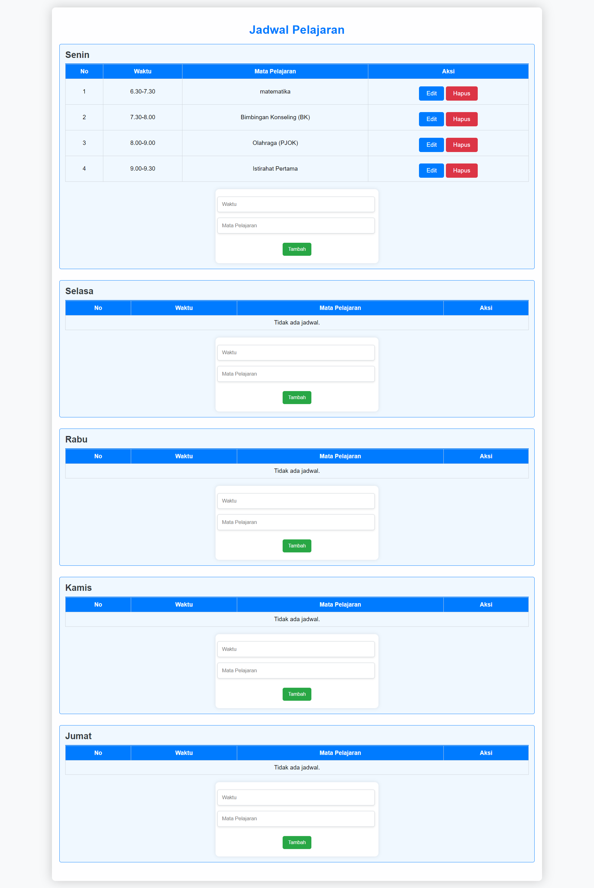

## Jadwal Pelajaran Sekolah
Ini adalah proyek web sederhana untuk menampilkan jadwal pelajaran sekolah. Proyek ini bertujuan untuk membantu siswa dan guru melihat jadwal harian mereka secara mudah melalui tampilan yang responsif dan sederhana.


### Fitur
- Tampilan Jadwal Harian: Menampilkan jadwal pelajaran setiap hari dari Senin hingga Sabtu.
- Filter Hari: Pengguna dapat memilih hari tertentu untuk melihat jadwal yang relevan.
- Responsif: Desain responsif yang bisa diakses melalui perangkat desktop maupun mobile.
Data Dinamis: Jadwal bisa diperbarui melalui file database SQLite.

### Teknologi yang Digunakan
- HTML
- CSS
- PHP
- SQLite

### Cara Menggunakan
1. Clone repository ini:
 ``` git clone https://github.com/username/jadwal-pelajaran-sekolah.git```

2. Pastikan file ```jadwal.db``` (database SQLite) tersedia di dalam folder proyek. Jika belum ada, bisa dibuat menggunakan skrip SQL yang disediakan di repository.

3. jalaankan proyek di server lokal Anda (seperti XAMPP atau Laragon) dan buka index.php di browser untuk melihat tampilan jadwal.

# TRIMAKASI

